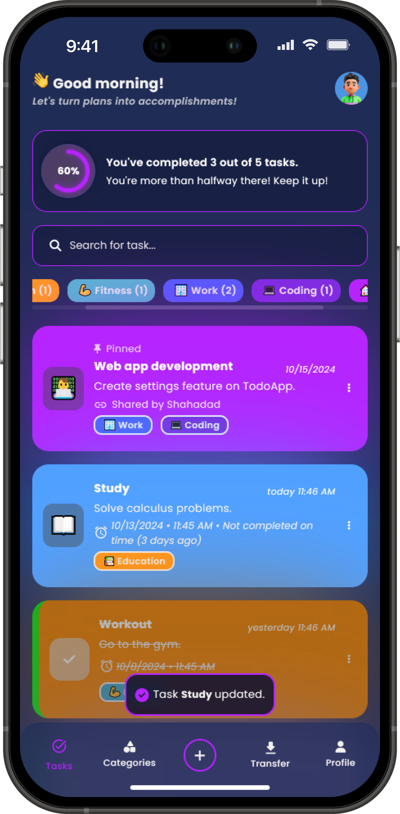
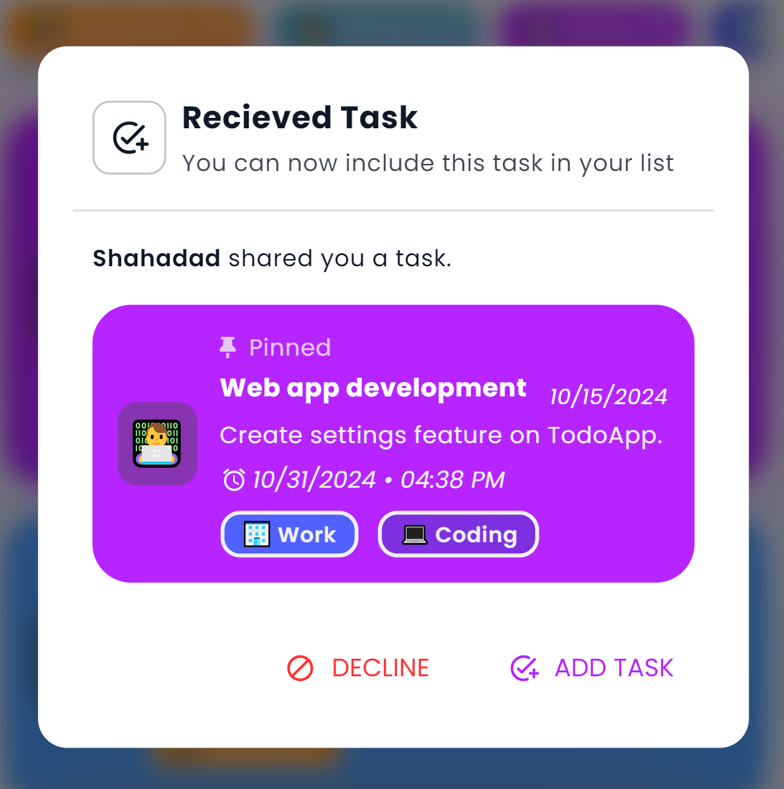
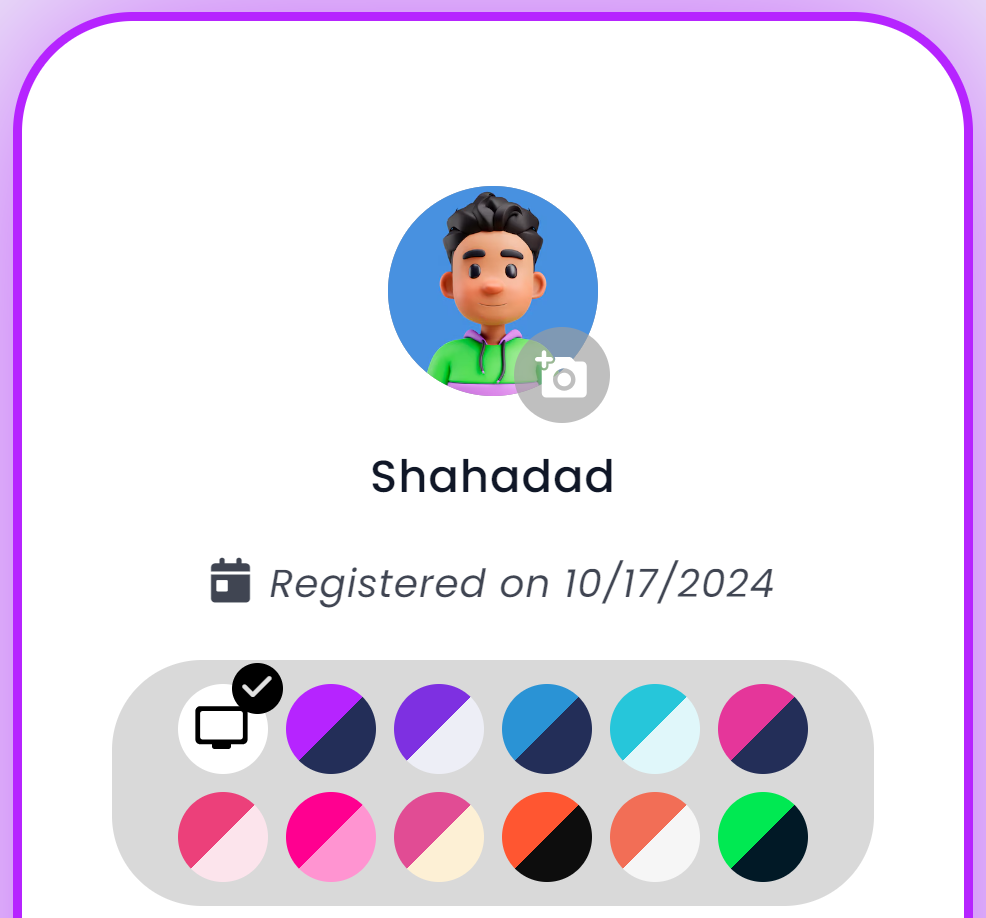
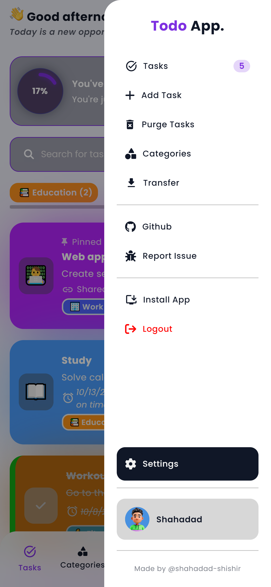
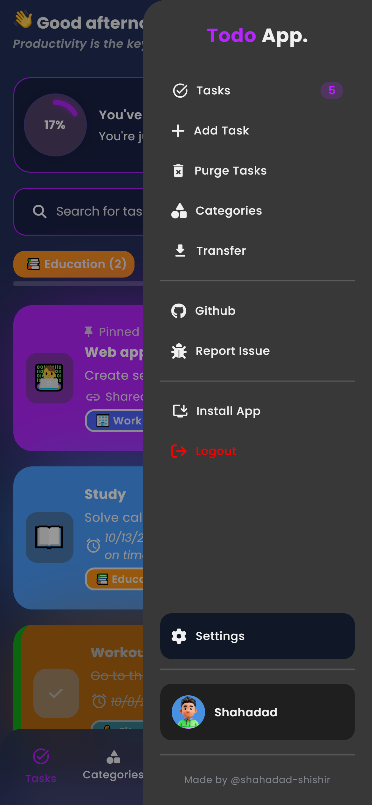
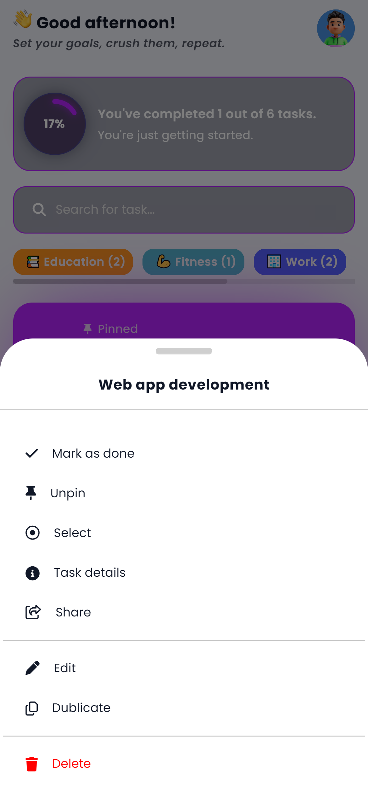
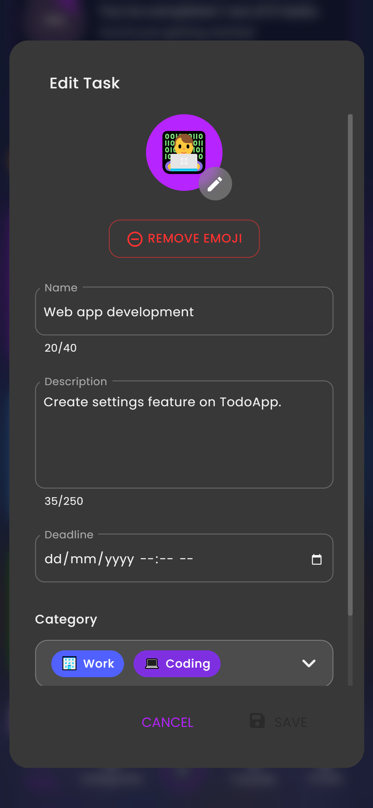
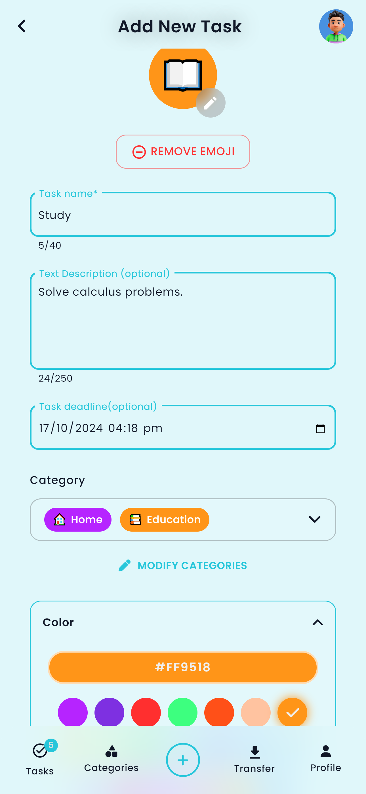
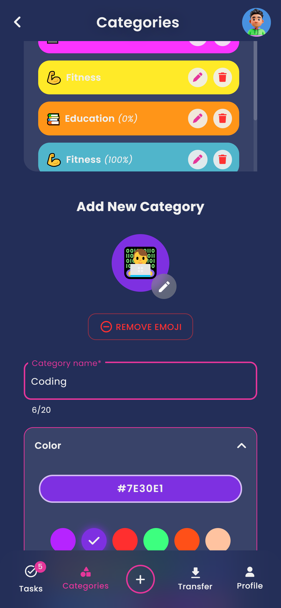
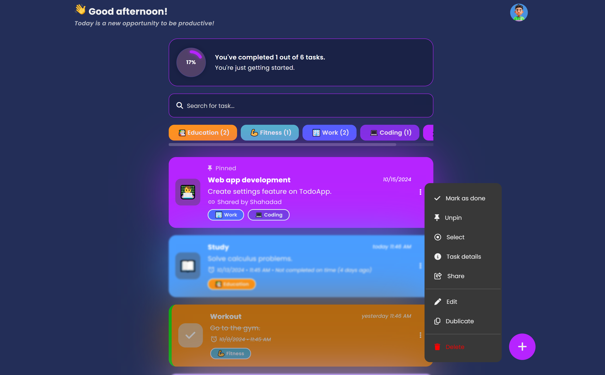

<h1>📝Vanilla JS Todo App</h1>

## [https://js-cool-todo-app.netlify.app/](https://js-cool-todo-app.netlify.app/)

## 💻 Tech Stack

<ul style="display: flex; flex-direction: column; gap:10px;">
  <li style="vertical-align: middle;">
     HTML
  </li>
    <li style="vertical-align: middle;">
     CSS
  </li>
    <li style="vertical-align: middle;">
     JavaScript
  </li>
</ul>

## ⚡ Features

### ✅ Task Management

- **Add, edit, dublicate, and delete tasks**: Easily manage your to-do list with intuitive controls.
- **Task filters**: Filter tasks by categories and search by keywords.
- **📌 Pin tasks**: Pin important tasks to keep them at the top of your list.
- **✅ Mark Done**: Easily mark tasks as completed, and they will appear differently to help you distinguish between finished and pending tasks.
- **📥 Import/Export Tasks**: Back up tasks by importing or exporting them as JSON files. This allows users to transfer tasks between devices easily.  
  [Example Import File](./example-import.json)
- **🔗 Share Tasks via Link or QR Code**: Users can share their tasks with others via a link or QR code, with the option to download the QR code for sharing. [Example Link](https://js-cool-todo-app.netlify.app/share?task=%7B%22id%22%3A%227558550233035%22%2C%22name%22%3A%22Web%20app%20development%20%22%2C%22description%22%3A%22Create%20settings%20feature%20on%20TodoApp.%22%2C%22deadline%22%3A%222024-10-31T16%3A38%22%2C%22emoji%22%3A%22%F0%9F%91%A8%E2%80%8D%F0%9F%92%BB%22%2C%22color%22%3A%22%23b624ff%22%2C%22category%22%3A%5B%7B%22id%22%3A%222%22%2C%22name%22%3A%22Work%22%2C%22emoji%22%3A%22%F0%9F%8F%A2%22%2C%22color%22%3A%22%235061ff%22%7D%2C%7B%22id%22%3A%223751115%22%2C%22name%22%3A%22Coding%20%22%2C%22emoji%22%3A%22%F0%9F%92%BB%EF%B8%8F%22%2C%22color%22%3A%22%237e30e1%22%7D%5D%2C%22done%22%3Afalse%2C%22pinned%22%3Atrue%2C%22createDate%22%3A%222024-10-15T05%3A39%3A14.104Z%22%2C%22sharedBy%22%3A%22Shahadad%22%7D&user=shahadad)

  

- **🗂️ Bulk Actions**: Select multiple tasks and perform actions like delete or mark as done for all at once. *(Feature coming soon.)*
- **🧹 Purge Tasks**: A feature to remove completed or unwanted tasks in one action. *(Feature coming soon.)*

### 🖥️ User Interface

- **📱 Responsive design**: Fully optimized for both mobile devices and desktops, with a seamless experience across all screen sizes.
- **🔄 Sidebar navigation**: Swipe to show or hide the sidebar for quick access to categories.
- **📥 Bottom Navbar**: A bottom navigation bar for quick access to core features on mobile or smaller screens.

### 🎨 Customization

- **🗂️ Custom categories**: Create and manage custom categories for organizing your tasks.
- **🎨 Color Themes**: Choose from a variety of color themes to personalize your app experience, including light and dark modes.

  
  
- **⚙️ App Settings**: Customize app behavior and preferences in a settings panel. *(Feature coming soon.)*

### ⚡ Performance & Optimization

- **🔄 Single Page Application (SPA)**: Enjoy fast page transitions without reloading.
- **⚙️ Lazy loading**: Improve performance by loading content only when needed.
- **📱 Progressive Web App (PWA)**: Install the app like a native mobile app, use it offline, and receive push notifications. *(Feature coming soon.)*

### 🎁 Additional Features

- **📦 Local storage**: Your tasks are saved locally, ensuring persistence even after refreshing the page.
- **💬 Motivational quotes**: Get inspired by a random motivational quote to boost your productivity.
- **📊 Progress tracking**: Track your task completion progress in a clear and concise way.
- **🔔 Toast notifications**: Receive instant feedback on your actions, such as task saved or deleted.
- **📝 Session storage**: Retain form data using session storage to avoid losing information while adding tasks or categories. *(Feature coming soon.)*

## 📷 Screenshots

## 👨‍💻 Installation

To install and run the project locally, follow these steps:

- Clone the repository: `git clone https://github.com/shahadad-shishir/TodoApp.git`
- Navigate to the project directory: `cd TodoApp`
- Open the project in Visual Studio Code: `code .`
- Run the project:
  - Use the Live Server extension (for Visual Studio Code):
    - Right-click on index.html and select "Open with Live Server".

The app will be accessible in your browser at [http://127.0.0.1:5501/](http://127.0.0.1:5501/) (or the port assigned by your live server).

**Note:** This application is built as a Single Page Application (SPA) using vanilla JavaScript. When run on a local server, such as VS Code Live Server, reloading the page with different pathnames may cause the application to not load properly due to the way SPAs handle routing. However, once deployed on hosting platforms like Netlify, this issue is resolved, and the application will function correctly across all routes.